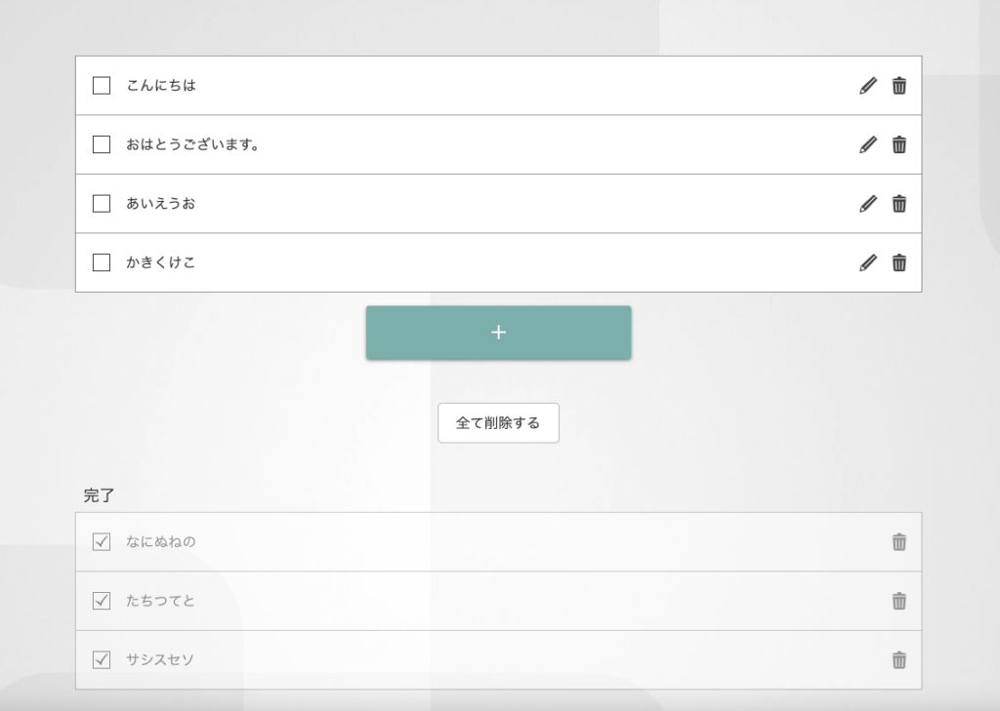

# SZPP Web開発部まとめ回 ～ToDoリストを作ろう～
<h3>作成日：2025/07/16</h3>
<h3>作成者：Arm203</h3>

## 今回の目的
* Webアプリケーションの作り方・構成を学ぶ.
* HTML,CSS,JavaScriptの復習をする.
* 手を動かす.

## 事前準備
`https://github.com/ayumu203/szpp-todo-2025`からリポジトリをクローンしてくる. \
`git clone`コマンドを使うか,GitHubのサイトからZIPファイルをダウンロードしてくる. \
クローンしてきたら,VSCodeなどのエディタで開く.

## 今回の手順
1. ヘッダーとフッターを作る.
2. ToDoリストの要件を考える.
3. メイン画面の実装
4. タスクの取得
5. タスクの登録
6. タスクの完了と削除

<!-- まずはページの構成から -->

## ヘッダーとフッター
### ヘッダー
ヘッダーにはだいたいページのタイトルとかロゴ,ナビゲーションを設置することが多い.

### フッター
ページ作成者の情報,著作権の表示,連絡先を書くことが多い.

### HTMLで実装
index.htmlの`<header>`タグと`<footer>`タグの中のヘッダーとフッターの内容を変えてみよう. 
<!-- ここでヘッダーとフッターの作成 -->
<!-- 雛形の配布とすこし書き換え(2分くらい) -->

## Todoリストって？
### イメージ


<!-- この画像のようにタスクを「登録」、「完了」、「削除」の操作を行うアプリ -->

### 機能
* タスクの登録 $\rightarrow$ タスクの入力と登録ボタンがほしい
* タスクの完了 $\rightarrow$ タスクの横に完了ボタンがほしい
* タスクの削除 $\rightarrow$ タスクの横に削除ボタンがほしい

## 画面実装
コードは`<main>`タグの中に書いていく. \
実際のホームページでも,mainタグの中にコンテンツが書かれていることも多い. \
IDやクラス名はCSSで決まっているので,合わせる方が良い. \
わからない場所はstep1.htmlを参考にしたり、先輩に聞く. 
<!-- まずはフォームの作成、IDに注意 -->
<!-- 次にタスクの表示 -->
<!-- モックを作成する -->
<!-- モックとは実際のデータを入れる前の借りの見た目 -->
```html
<!DOCTYPE html>
<html lang="ja">
<head>
    <meta charset="UTF-8">
    <meta name="viewport" content="width=device-width, initial-scale=1.0">
    <title>todoアプリ</title>
    <link rel="stylesheet" href="index.css">
</head>
<body>
     <header>
        <h1>Todoアプリ</h1>
     </header>
     <main>
        <!-- まずはタスクを入力するフォーム -->
         <form>
            <!-- 入力フォーム -->
            <input id="taskInput" type="text" value="" placeholder="タスクを入力">
            <!-- 登録フォーム -->
            <input id="regButton" type="button" value="register">
         </form>
         <div>
            <!-- とりあえずダミー -->
            <ul>
                <!-- ToDoリストの1タスク -->
                <span class="todoItem">
                    <!-- 内容 -->
                    <li>タスク1</li>
                    <!-- 完了ボタン -->
                    <input class="finButton" type="button" value="finish">
                    <!-- 削除ボタン -->
                    <input class="delButton" type="button" value="delete">
                </span>
                <span class="todoItem">
                    <li>タスク2</li>
                    <input class="finButton" type="button" value="finish">
                    <input class="delButton" type="button" value="delete">
                </span>
                <span class="todoItem">
                    <li>タスク3</li>
                    <input class="finButton" type="button" value="finish">
                    <input class="delButton" type="button" value="delete">
                </span>
            </ul>
         </div>
     </main>
     <footer>
        <h3>作成者:Arm203</h3>
        <h4>連絡先:ochiohita@gmail.com</h4>
     </footer>
    <script src="https://code.jquery.com/jquery-3.6.0.min.js"></script>
    <script src="main.js"></script>
</body>
</html>
```

## JSで入力の取得
### jQueryの復習
#### イベントの検知
```javascript
$(監視対象).監視状態(イベント, 関数);
// 画面が読み込まれたとき
$(document).ready(function(){
    // idなら「#id名 , classなら「.クラス名」を指定
    $('#regButton').on('click',function(){
        // 処理
    });
});
```
#### データの取得
```javascript
// 監視対象の値を取得
$(監視対象).val(); 
```

## 実装
ここからはjQueryを使って実際にタスクの入力を取り出す. \
step2.jsを参考にしながら,main.jsを編集していく. \
まずは,タスクの入力を取得してコンソールに出力する. \
実装ができたら,F12キーを押して、コンソールの値を確認をする.

```javascript
// 画面が読み込まれて以降の処理
$(document).ready(function() {
    // 登録ボタンが押されたら
    $('#regButton').on('click', function() {
        // タスク入力からデータを取得
        // trimはデータの空白を削除して取得する文字列のメソッド(機能)
        const taskValue = $('#taskInput').val().trim();
        // データが入っているなら
        if (taskValue) {
            console.log(`入力されたタスク: ${taskValue}`);
        } else {
            console.log('タスクが入力されていません。');
        }
    });
});
```
## JSでタスクの作成
### jQueryの復習2
#### 要素の作成
```javascript
// 空の要素の作成
const 要素 = $('<タグ名>');
```
#### 要素の属性の設定
```javascript
// クラスの追加
要素.addClass('クラス名');

// IDの追加
要素.attr('id', 'ID名');

// テキストの追加
要素.text('テキスト内容');

// attrの使い方
要素.attr('属性名', '値');  

// 例えば
const button = $('<button>');
button.attr('id', 'regButton');
```
#### 複数の属性の設定
```javascript
// 複数の属性を設定も可能
要素.attr({
    '属性名1': '値1',
    '属性名2': '値2'
});

// 例えば
const button = $('<button>');
button.attr({   
    'id': 'regButton',
    'class': 'btn btn-primary'
});
```

#### 子要素の追加
```javascript   
// 要素の子要素に追加
親要素.append(子要素);
// 例えば
const taskList = $('#taskList');
const newTask = $('<li>').text('新しいタスク');
taskList.append(newTask);
```

## 実装
ここからは、タスクの登録ボタンを押したときに、タスクをリストに追加する処理を実装する. \
step3.jsを参考にしながら、main.jsを編集していく. \
タスクの入力を取得して、リストに追加する. \
実装ができたら、HTMLのモック要素をコメントアウトまたは削除し、機能を確認する. 

```javascript
// 画面が読み込まれて以降の処理
$(document).ready(function() {
    // 登録ボタンが押されたら
    $('#regButton').on('click', function() {
        // タスク入力からデータを取得
        // trimはデータの空白を削除して取得する文字列のメソッド(機能)
        const taskValue = $('#taskInput').val().trim();
        // データが入っているなら
        if (taskValue) {
            // console.log(`入力されたタスク: ${taskValue}`);
            // todoItemを作成
            const todoItem = createTodoItem(taskValue);
            // 作成したtodoItemを表示するリストに追加
            $('#todoList').append(todoItem);
            // 入力欄を空にする
            $('#taskInput').val('');
        } else {
            // console.log('タスクが入力されていません。');
        }
    });
});

// todoItemを作成する関数
function createTodoItem(taskValue) {
    // span要素を作成,todoItemというクラス名を設定
    const todoItem = $('<span>').addClass('todoItem');

    // li要素を作成してタスク内容を設定
    const taskElement = $('<li>').text(taskValue);

    // 完了ボタンを作成
    const finButton = $('<input>').attr({
        type: 'button',
        value: 'finish'
    }).addClass('finButton');

    // 削除ボタンを作成
    const delButton = $('<input>').attr({
        type: 'button',
        value: 'delete'
    }).addClass('delButton');

    // span要素に子要素を追加
    todoItem.append(taskElement, finButton, delButton);

    // 作成したtodoItemを返す
    return todoItem;
}
```

## JSで完了と削除
### jQueryの復習3
#### 要素の削除
```javascript
// 要素の削除
要素.remove();  
```

#### 要素に斜線を入れる
```javascript
// 要素に斜線を入れる   
要素.css('text-decoration', 'line-through');
```

#### thisの使い方
```javascript   
// イベントハンドラ内でのthisは、イベントが発生した要素を指す
$(監視対象).on('イベント', function() {
    // thisはイベントが発生した要素
    console.log($(this).text());
});
```

#### 要素の兄弟要素の取得
```javascript   
// 兄弟要素の取得
$(this).siblings('セレクタ');
// 例えば、thisの兄弟要素のliを取得
$(this).siblings('li'); 
```

## 実装
ここからは、タスクの完了と削除の機能を実装する. \
完了ボタンを押したときに、タスクに斜線を入れる処理と、削除ボタンを押したときにタスクを削除する処理を実装する. \
実装ができたら、完了と削除の機能を確認する.
step4.jsを参考にしながら、main.jsを編集していく. \  
```javascript
// 画面が読み込まれて以降の処理
$(document).ready(function() {
    // 登録ボタンが押されたら
    $('#regButton').on('click', function() {
        // タスク入力からデータを取得
        // trimはデータの空白を削除して取得する文字列のメソッド(機能)
        const taskValue = $('#taskInput').val().trim();
        // データが入っているなら
        if (taskValue) {
            // console.log(`入力されたタスク: ${taskValue}`);
            // todoItemを作成
            const todoItem = createTodoItem(taskValue);
            // 作成したtodoItemを表示するリストに追加
            $('#todoList').append(todoItem);
            // 入力欄を空にする
            $('#taskInput').val('');
        } else {
            // console.log('タスクが入力されていません。');
        }
    });

    // 完了ボタンの機能（斜線をトグル）
    $('#todoList').on('click', '.finButton', function() {
        const taskElement = $(this).siblings('li');
        const isCompleted = taskElement.css('text-decoration').includes('line-through');
        taskElement.css('text-decoration', isCompleted ? 'none' : 'line-through');
        console.log(isCompleted ? 'タスクが未完了に戻りました:' : 'タスクが完了しました:', taskElement.text());
    });

    // 削除ボタンの機能
    $('#todoList').on('click', '.delButton', function() {
        const todoItem = $(this).closest('.todoItem');
        todoItem.remove();
        console.log('タスクが削除されました');
    });
});

// todoItemを作成する関数
function createTodoItem(taskValue) {
    // span要素を作成,todoItemというクラス名を設定
    const todoItem = $('<span>').addClass('todoItem');

    // li要素を作成してタスク内容を設定
    const taskElement = $('<li>').text(taskValue);

    // 完了ボタンを作成
    const finButton = $('<input>').attr({
        type: 'button',
        value: 'finish'
    }).addClass('finButton');

    // 削除ボタンを作成
    const delButton = $('<input>').attr({
        type: 'button',
        value: 'delete'
    }).addClass('delButton');

    // span要素に子要素を追加
    todoItem.append(taskElement, finButton, delButton);

    // 作成したtodoItemを返す
    return todoItem;
}

```

## 完成
これでToDoリストの基本的な機能が完成した. \
実際にはこれらの機能だけでは不便であると思う. \
例えばタスクの保存をローカルストレージに保存する. \
タスクの編集機能を実装する. \
色々あると思う. \
夏休みにはこれらの機能の実装や新しいアプリの作成してみよう. 

## 今後
今後(後期)からは本格的なWeb開発を学ぶ. \
一応今回の内容の復習もいれるが,できれば夏休み中に復習してくれると嬉しい. \
夏休み中も一回くらいはオンラインで開発を行うかもしれない(未定). \
また夏休み後に会いましょう! 
